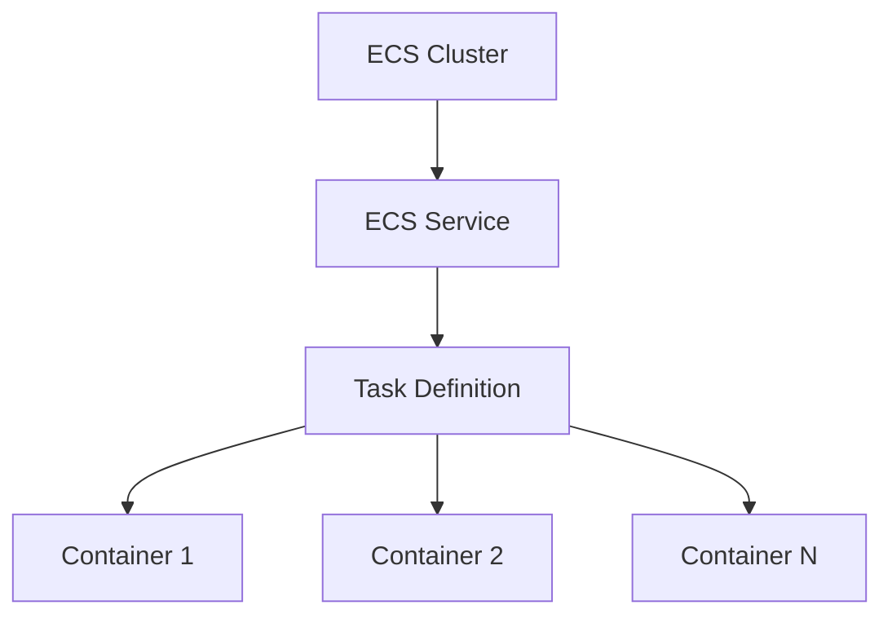

# 🚀 Deploying to Amazon ECS

## **📚 Understanding ECS Concepts**

### What is ECS?

Amazon Elastic Container Service (ECS) is AWS's container orchestration service. Think of it as a system that manages where and how your Docker containers run in the cloud.

## **🚀 ECS Launch Types**

| Launch Type     | You Manage               | Best For               | Common Use Cases                                  |
| --------------- | ------------------------ | ---------------------- | ------------------------------------------------- |
| **AWS Fargate** | Nothing - fully managed  | Teams focused on apps  | • Microservices • Web applications • API backends |
| **EC2**         | EC2 instances & capacity | Infrastructure control | • Legacy apps • GPU workloads • Cost optimization |

**AWS Fargate (Serverless)**

- No servers to manage or maintain
- Pay only for resources your containers use
- Automatic scaling and high availability
- Perfect for teams that want to focus on application development

**Amazon EC2**

- Full control over infrastructure
- Custom instance types and configurations
- Access to instance operating system
- Ideal when you need specific hardware or compliance requirements

### Key ECS Components

#### 1. ECS Cluster

- A logical grouping of resources
- Like an apartment building that houses your containers
- Can contain multiple services and tasks

#### 2. Task Definition

Think of this as the blueprint for your application. It includes:

- Which container image to use
- How much CPU and memory to allocate
- Port mappings
- Environment variables
- Storage configurations

Example Task Definition components:

```
{
  "family": "web-app",
  "containerDefinitions": [
    {
      "name": "web", // Container name
      "image": "nginx:latest", // Docker image
      "cpu": 256, // CPU units
      "memory": 512, // Memory in MB
      "portMappings": [
        {
          // Port configurations
          "containerPort": 80
        }
      ]
    }
  ]
}
```

#### 3. ECS Service

- Ensures your desired number of tasks are always running
- Handles load balancing and scaling
- Restarts failed containers automatically

Think of it as a restaurant manager who:

- Makes sure there are always enough servers (tasks)
- Distributes customers (traffic) evenly
- Replaces sick staff (failed containers)

### 🔄 How It All Works Together



1. **Cluster** provides the infrastructure
2. **Service** maintains desired task count
3. **Task Definition** specifies how containers run
4. **Containers** run your application

## **📌 What We'll Do**

In this section, we will:

- ✅ Create an ECS Cluster
- ✅ Configure a Task Definition
- ✅ Deploy an ECS Service
- ✅ Access our application

## **1️⃣ Create an ECS Cluster**

### Using AWS Console:

1. Open the [Amazon ECS console](https://console.aws.amazon.com/ecs/)
2. Click **Create Cluster**
3. Select **AWS Fargate** (Serverless)
4. Configure basic settings(Leave everything else to default values):
   ```
   Cluster Name: rent-a-room-cluster

   ```
5. Click **Create**

### Using AWS CLI:

```bash

# Check if the ECS service-linked role already exists
if ! aws iam get-role --role-name AWSServiceRoleForECS &> /dev/null; then
  echo "Creating ECS service-linked role..."
  aws iam create-service-linked-role --aws-service-name ecs.amazonaws.com
  
  # Wait for role to propagate
  echo "Waiting for role to propagate..."
  sleep 20
else
  echo "✅ ECS service-linked role already exists"
fi

# Create the ECS cluster
echo "Creating ECS cluster..."
aws ecs create-cluster --cluster-name rent-a-room-cluster
```

## **2️⃣ Create Task Definition**

### Using AWS Console:

1. In ECS console, go to **Task Definitions**
2. Click **Create new Task Definition**
3. Configure settings(Leave other fields to default values):
   ```
   Family: rent-a-room-task
   Launch type: FARGATE
   Operating system/Architecture: Linux/ARM64
   Task Role: ecsTaskExecutionRole (⚠️ if not in dropdown, just leave it to "None")
   Task memory: 3GB
   Task CPU: 1 vCPU
   ```
4. Add container( ⚠️ Be sure to replace the image prefix with your DockerHub Username below):
   ```
   Container name: rent-a-room
   Image: YOUR_DOCKERHUB_USERNAME/rent-a-room:latest
   Port mappings: 80
   ```
6. Click **Create**

### Using AWS CLI:

Save this as `task-definition.json`:

```bash
cat << EOF > task-definition.json
{
    "family": "rent-a-room-task",
    "networkMode": "awsvpc",
    "requiresCompatibilities": ["FARGATE"],
    "cpu": "256",
    "memory": "512",
    "runtimePlatform": {
        "cpuArchitecture": "ARM64",
        "operatingSystemFamily": "LINUX"
    },
    "containerDefinitions": [{
        "name": "rent-a-room",
        "image": "${DOCKER_USERNAME}/rent-a-room:latest",
        "portMappings": [{
            "containerPort": 80,
            "hostPort": 80,
            "protocol": "tcp"
        }]
    }]
}
EOF
```

Then run:

```bash
aws ecs register-task-definition --cli-input-json file://task-definition.json
```

## **3️⃣ Create ECS Service**

### Using AWS Console:

1. In your cluster, click [**Create Service**](https://console.aws.amazon.com/ecs/v2/clusters/rent-a-room-cluster/create-service)
2. Configure service:
   ```
   Task Definition family: rent-a-room-task
   Service name: rent-a-room-service (⚠️ System with automatically add task-random string to end. Delete the entire text and paste "rent-a-room-service")
   Launch type: FARGATE
   Platform Version: LATEST
   Service Type: Replica
   Desired Tasks: 1
   ```
3. Configure networking:
   ```
   VPC: Default VPC
   Subnets: Select all available (No need to change this)
   Security group: Create new
   Security Group Name: ecs-rent-a-room-sg
   Type: Custom TCP
   Port Range: 80
   Values: Your IP Address/32 (To obtain your Personal IP address, [Navigate here](checkip.amazonaws.com), you will need to add /32 to the end of the vaule you see on the webpage. ex. 123.123.123.123/32)
   ⚠️ If this addess is incorrect, you will not be able to access the ECS Service!
   ```
4. Click **Create Service**

### Using AWS CLI:

```bash
# Get default VPC ID
VPC_ID=$(aws ec2 describe-vpcs \
    --filters Name=isDefault,Values=true \
    --query 'Vpcs[0].VpcId' \
    --output text)

# Get first subnet ID from default VPC
SUBNET_ID=$(aws ec2 describe-subnets \
    --filters Name=vpc-id,Values=$VPC_ID \
    --query 'Subnets[0].SubnetId' \
    --output text)

# Create security group
SECURITY_GROUP_ID=$(aws ec2 create-security-group \
    --group-name ecs-rent-a-room-sg \
    --description "Security group for Rent-A-Room ECS service" \
    --vpc-id $VPC_ID \
    --query 'GroupId' \
    --output text)

# Add inbound rule for port 80
aws ec2 authorize-security-group-ingress \
    --group-id $SECURITY_GROUP_ID \
    --protocol tcp \
    --port 80 \
    --cidr 0.0.0.0/0

# Create the ECS service with dynamic values
aws ecs create-service \
    --cluster rent-a-room-cluster \
    --service-name rent-a-room-service \
    --task-definition rent-a-room-task \
    --desired-count 1 \
    --launch-type FARGATE \
    --network-configuration "awsvpcConfiguration={subnets=[$SUBNET_ID],securityGroups=[$SECURITY_GROUP_ID],assignPublicIp=ENABLED}"
```

## **4️⃣ Access Your Application**

### Using AWS Console:

1. In the [Amazon ECS console](https://console.aws.amazon.com/ecs/v2/clusters/rent-a-room-cluster/services/rent-a-room-task-service/tasks/), navigate to your task
2. Click on the running task
3. In the **Configuration** Section, find the **Public IP** 
4. Access your application: `http://[PUBLIC_IP]`
⚠️ Please be sure to connect via http and not https. If you still cannot connect, go to the [**Service**](https://console.aws.amazon.com/ecs/v2/clusters/rent-a-room-cluster/services/rent-a-room-task-service/configuration), Under Network Configuration, Click on the **Security Group**, then click on **Edit inbound rules** -> Click the **Source** Dropdown and select **My IP**. Try to access the Task IP address again and you should be able to access the ECS Task. If you still have trouble, be sure that you have the correct image name, tag and that you have replaced the "YOUR_DOCKERHUB_USERNAME/rent-a-room:latest" with your actual DockerHub Username).

### Using AWS CLI:

```bash
# Wait for service to be stable
echo "Waiting for ECS service to be stable..."
aws ecs wait services-stable \
    --cluster rent-a-room-cluster \
    --services rent-a-room-service

# Get the task ARN (with verification)
echo "Getting task information..."
TASK_ARN=$(aws ecs list-tasks \
    --cluster rent-a-room-cluster \
    --service-name rent-a-room-service \
    --query 'taskArns[0]' \
    --output text)

if [ "$TASK_ARN" == "None" ] || [ -z "$TASK_ARN" ]; then
    echo "No tasks found. Waiting for tasks to start..."
    sleep 30  # Wait for tasks to start
    TASK_ARN=$(aws ecs list-tasks \
        --cluster rent-a-room-cluster \
        --service-name rent-a-room-service \
        --query 'taskArns[0]' \
        --output text)
fi

echo "Task ARN: $TASK_ARN"

# Wait for task to be running
echo "Waiting for task to be running..."
aws ecs wait tasks-running \
    --cluster rent-a-room-cluster \
    --tasks $TASK_ARN

# Get the ENI ID attached to the task
echo "Getting network interface ID..."
ENI_ID=$(aws ecs describe-tasks \
    --cluster rent-a-room-cluster \
    --tasks $TASK_ARN \
    --query 'tasks[0].attachments[0].details[?name==`networkInterfaceId`].value' \
    --output text)

echo "ENI ID: $ENI_ID"

# Get the public IP
if [ ! -z "$ENI_ID" ]; then
    echo "Getting public IP..."
    PUBLIC_IP=$(aws ec2 describe-network-interfaces \
        --network-interface-ids $ENI_ID \
        --query 'NetworkInterfaces[0].Association.PublicIp' \
        --output text)

    echo "Your application is available at: http://$PUBLIC_IP:80"
else
    echo "Could not get network interface ID. Task might still be starting."
fi
```

## **🔍 Monitoring**

Monitor your application using:

- ECS console dashboard
- CloudWatch metrics
- Container insights (if enabled)

## **💡 Pro Tips**

- Start with Fargate for simplicity
- Use Task Definitions for repeatable deployments
- Implement service auto-scaling for production
- Consider using Application Load Balancer for web applications
- Enable Container Insights for better monitoring

## **🎯 Key Takeaways**

| Concept             | Understanding                                                              |
| ------------------- | -------------------------------------------------------------------------- |
| **ECS Cluster**     | The foundation that hosts your containers - like a virtual data center     |
| **Launch Types**    | Fargate (serverless) vs EC2 (server-based) - choose based on your needs    |
| **Task Definition** | The blueprint that defines how your container should run                   |
| **ECS Service**     | The manager that maintains your desired container state                    |
| **Architecture**    | Understanding how all components work together for container orchestration |

## **🚀 Next Steps**

Now that you have:

- ✅ Created an ECS cluster
- ✅ Deployed a containerized application
- ✅ Learned about ECS components
- ✅ Accessed your running application

✨ Continue to CI/CD Pipeline Setup ▶️
