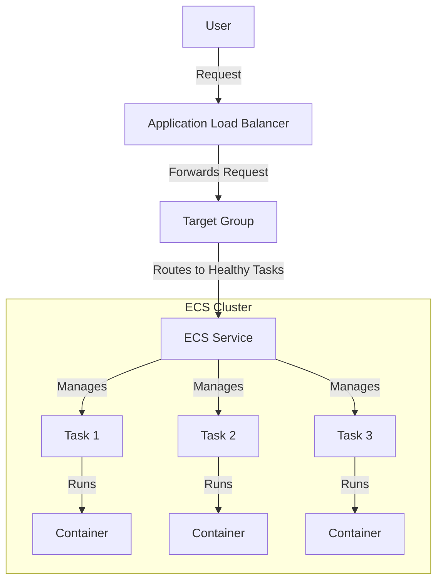
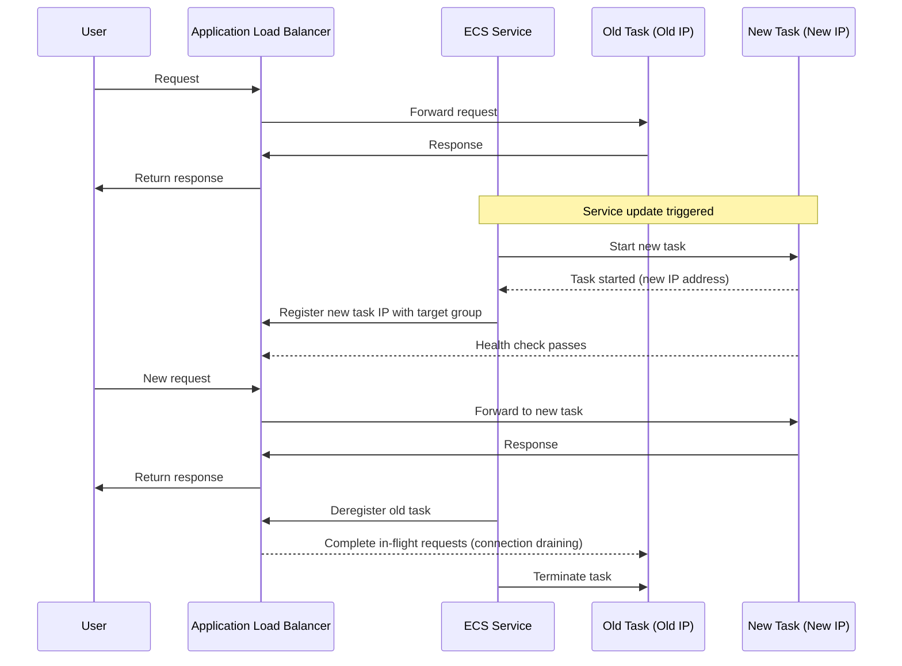

# Adding a Load Balancer to ECS

## **🎯 Why Use a Load Balancer?**

When deploying applications to ECS, a load balancer provides numerous benefits over accessing containers directly via their IP addresses:

- **Stable endpoint** that doesn't change when containers restart
- **Automatic scaling** across multiple tasks
- **Health checks** to route traffic only to healthy containers
- **High availability** by distributing traffic across multiple Availability Zones

## **📊 Load Balancer vs. Direct IP Access**

| Feature | With Load Balancer | Direct IP Access (Single Task) |
|---------|-------------------|------------------------------|
| **Access Point Stability** | ✅ Stable DNS name that never changes | ❌ IP address changes when tasks restart |
| **Scaling** | ✅ Seamlessly distributes traffic across multiple tasks | ❌ Limited to single task capacity |
| **High Availability** | ✅ Continues functioning if individual tasks fail | ❌ Service unavailable if the single task fails |
| **Health Checks** | ✅ Automatic health monitoring and unhealthy task removal | ❌ No health checking; manual monitoring required |
| **Traffic Distribution** | ✅ Intelligent traffic routing (round-robin, least connections) | ❌ No distribution; all requests hit the same task |
| **SSL/TLS Termination** | ✅ Centralized certificate management and HTTPS support | ❌ Must implement TLS in each container |
| **Security** | ✅ WAF integration, security groups at load balancer level | ❌ Security controls needed on each task |
| **Advanced Routing** | ✅ Path-based, host-based routing, redirects | ❌ No routing capabilities |
| **Sticky Sessions** | ✅ Session affinity for stateful applications | ❌ No session management |
| **Blue/Green Deployments** | ✅ Easy implementation of zero-downtime deployments | ❌ Requires custom implementation |
| **Monitoring** | ✅ Centralized metrics (request counts, latency, errors) | ❌ Limited to container-level metrics |
| **Cost** | ❌ Additional cost for ALB/NLB | ✅ No additional infrastructure costs |
| **Complexity** | ❌ More complex initial setup | ✅ Simpler architecture |

## **🔄 Architecture with Load Balancer**



## **📚 Understanding Each Component**

### 1. **Application Load Balancer (ALB)**
A service that distributes incoming application traffic across multiple targets.

* **Function**: Entry point for all user traffic
* **Benefits**: Provides a stable DNS name for accessing your application
* **Features**: Content-based routing, health checks, and security features

### 2. **Target Group**
A group of targets (ECS tasks) that the load balancer routes traffic to.

* **Function**: Defines which tasks receive traffic and how they're checked for health
* **Configuration**: Health check settings, protocols, and ports
* **Relationship**: Connected to your ECS service containers

### 3. **ECS Service with Load Balancer Integration**
The ECS service configured to register tasks with the target group automatically.

* **Function**: Maintains task count and registers/deregisters tasks with the target group
* **Benefit**: Automatically handles unhealthy tasks
* **Configuration**: Maps container ports to the load balancer

## **📝 Implementation Steps**

### **1️⃣ Create a Target Group**

#### Using AWS Console:
1. Navigate to **Target Groups** in the [EC2 console](https://console.aws.amazon.com/ec2/home#TargetGroups)
3. Click **Create target group**
4. Configure settings:
   ```
   Target type: IP addresses
   Target group name: rent-a-room-tg
   Protocol: HTTP Port: 80
   Ip address type: IPv4
   VPC: Default VPC
   Protocol version: HTTP1
   Health check protocol: HTTP
   Health check path: /
   ```
5. Click **Next**
6. On the "Register targets" screen:
- ⚠️ **Important**: Do NOT add any IP addresses
- If you see any IP addresses listed, click "Remove"
- Click "Create target group"
**Note**: For ECS services, targets (task IPs) are registered automatically. You should create an empty target group and let ECS handle the registration.

#### Using AWS CLI:
```bash
# Get default VPC ID
VPC_ID=$(aws ec2 describe-vpcs \
    --filters Name=isDefault,Values=true \
    --query 'Vpcs[0].VpcId' \
    --output text)

# Create target group
aws elbv2 create-target-group \
    --name rent-a-room-tg \
    --protocol HTTP \
    --port 80 \
    --vpc-id $VPC_ID \
    --target-type ip \
    --health-check-path / \
    --health-check-interval-seconds 30 \
    --health-check-timeout-seconds 5 \
    --healthy-threshold-count 2 \
    --unhealthy-threshold-count 2
```

### **2️⃣ Create an Application Load Balancer**

#### Using AWS Console:
1. In the EC2 console, navigate to [**Load Balancers**](http://console.aws.amazon.com/ec2/home#LoadBalancers)
2. Click **Create load balancer**
3. Choose **Application Load Balancer**
4. Configure basic settings:
   ```
   Name: rent-a-room-alb
   Scheme: Internet-facing
   IP address type: IPv4
   ```
5. Configure network:
   ```
   VPC: Default VPC
   Mappings: Select all available subnets
   ```
6. Configure security groups:
   ```
   Create new security group
   Name: rent-a-room-alb-sg
   Rule: Allow HTTP (port 80) from anywhere
   ```
7. Configure listeners and routing:
   ```
   Protocol: HTTP
   Port: 80
   Default action: Forward to rent-a-room-tg
   ```
8. Click **Create load balancer**

#### Using AWS CLI:
```bash
# Create security group for ALB
ALB_SG_ID=$(aws ec2 create-security-group \
    --group-name rent-a-room-alb-sg \
    --description "Security group for Rent-A-Room ALB" \
    --vpc-id $VPC_ID \
    --query 'GroupId' \
    --output text)

# Allow inbound HTTP
aws ec2 authorize-security-group-ingress \
    --group-id $ALB_SG_ID \
    --protocol tcp \
    --port 80 \
    --cidr 0.0.0.0/0

# Get subnet IDs
SUBNET_IDS=$(aws ec2 describe-subnets \
    --filters Name=vpc-id,Values=$VPC_ID \
    --query 'Subnets[*].SubnetId' \
    --output json | tr -d '[:space:]')

# Create the load balancer
aws elbv2 create-load-balancer \
    --name rent-a-room-alb \
    --subnets $(echo $SUBNET_IDS | sed 's/\[//g' | sed 's/\]//g' | sed 's/,/ /g' | sed 's/"//g') \
    --security-groups $ALB_SG_ID

# Store the ALB ARN
ALB_ARN=$(aws elbv2 describe-load-balancers \
    --names rent-a-room-alb \
    --query 'LoadBalancers[0].LoadBalancerArn' \
    --output text)

# Get target group ARN
TG_ARN=$(aws elbv2 describe-target-groups \
    --names rent-a-room-tg \
    --query 'TargetGroups[0].TargetGroupArn' \
    --output text)

# Create listener
aws elbv2 create-listener \
    --load-balancer-arn $ALB_ARN \
    --protocol HTTP \
    --port 80 \
    --default-actions Type=forward,TargetGroupArn=$TG_ARN
```

### **3️⃣ Update ECS Service to Use the Load Balancer**

#### Using AWS Console:
1. Go to the [ECS console](https://console.aws.amazon.com/ecs/)
2. Select your cluster **rent-a-room-cluster**
3. Select your service **rent-a-room-service**
4. Click **Update**
5. Under **Load balancing**:
   ```
   Load balancer type: Application Load Balancer
   Target group name: rent-a-room-tg
   Container name: rent-a-room
   Container port: 80
   ```
6. Click **Update Service**

#### Using AWS CLI:
```bash
# Get target group ARN
TG_ARN=$(aws elbv2 describe-target-groups \
    --names rent-a-room-tg \
    --query 'TargetGroups[0].TargetGroupArn' \
    --output text)

# Update the service to use the load balancer
aws ecs update-service \
    --cluster rent-a-room-cluster \
    --service rent-a-room-service \
    --load-balancers "targetGroupArn=$TG_ARN,containerName=rent-a-room,containerPort=80" \
    --force-new-deployment
```

### **4️⃣ Access Your Application Through the Load Balancer**

#### Using AWS Console:
1. Go to the [EC2 console](https://console.aws.amazon.com/ec2/)
2. Navigate to **Load Balancers**
3. Select your load balancer **rent-a-room-alb**
4. Copy the **DNS name**
5. Access your application: `http://[DNS_NAME]`
6. NOTE: This will take a few minutes to propgate and accept traffic. 

#### Using AWS CLI:
```bash
# Get the load balancer DNS name
ALB_DNS=$(aws elbv2 describe-load-balancers \
    --names rent-a-room-alb \
    --query 'LoadBalancers[0].DNSName' \
    --output text)

echo "Your application is available at: http://$ALB_DNS"
echo "NOTE: This will take a few minutes to propgate and accept traffic."
```

## **🔄 What Happens When Tasks Get New IPs?**

One of the primary benefits of using a load balancer with ECS is handling IP changes seamlessly. Here's what happens during updates:

### The Task Update Process



### How It Works:

1. **Automatic Registration**
   - When a new task starts, ECS automatically registers its IP with the target group
   - Load balancer begins health checks on the new IP
   - Once healthy, the new task starts receiving traffic

2. **Connection Draining**
   - When a task stops, ECS deregisters it from the target group
   - Load balancer stops sending *new* requests to that task
   - Existing connections complete (default: 300 seconds)
   - After draining, the task terminates

3. **DNS Stability**
   - The load balancer's DNS name remains unchanged
   - Clients continue accessing the same endpoint
   - Traffic routes automatically to healthy tasks only

### Why This Matters

| Without Load Balancer | With Load Balancer |
|-----------------------|-------------------|
| 🔴 IP changes require DNS updates | ✅ DNS endpoint remains stable |
| 🔴 Clients see connection errors during updates | ✅ Transitions are seamless to users |
| 🔴 No health checking before sending traffic | ✅ Only healthy tasks receive traffic |
| 🔴 Manual intervention needed for task failures | ✅ Automatic failover to healthy tasks |

## **🔍 Verifying Your Setup**

After completing the setup, verify everything is working properly:

### 1. **Check Target Health**
Navigate to EC2 → Target Groups → Select your target group → Targets tab
* ✅ Status should be "healthy" for your tasks
* ❌ If "unhealthy," check your health check settings and container configuration

### 2. **Check Load Balancer Listener**
Navigate to EC2 → Load Balancers → Select your ALB → Listeners tab
* ✅ Should have a listener for HTTP:80
* ✅ Rules should forward to your target group

### 3. **Check ECS Service**
Navigate to ECS → Clusters → Your cluster → Services → Your service → Events tab
* ✅ Should see successful registration of tasks with target group

## **🔧 Troubleshooting Tips**

1. **Tasks aren't registering with target group**
   * Ensure container port in task definition matches target group port
   * Check if security groups allow traffic between ALB and tasks

2. **Health checks failing**
   * Verify health check path exists in your application
   * Ensure container is listening on the correct port
   * Check security groups allow health check traffic

3. **Cannot access application via load balancer**
   * Verify load balancer security group allows inbound traffic
   * Check if load balancer is in the same VPC as your tasks
   * Ensure target group has healthy targets

## **📈 Scaling Your Application**

With your load balancer in place, you can now scale your application:

```bash
# Update service to increase task count
aws ecs update-service \
    --cluster rent-a-room-cluster \
    --service rent-a-room-service \
    --desired-count 3
```

The load balancer will automatically distribute traffic to all healthy tasks!

## **🚀 Advanced Configurations**

Once your basic setup is working, consider these enhancements:

1. **HTTPS Support**:
   Add a certificate in AWS Certificate Manager and configure HTTPS listener

2. **Path-Based Routing**:
   Route different URLs to different services (e.g., /api to backend, / to frontend)

3. **Auto Scaling**:
   Configure your service to scale based on CPU/memory metrics or request count:

   ```bash
   # Check if the ECS service-linked role already exists
    if ! aws iam get-role --role-name AWSServiceRoleForECS &> /dev/null; then
      echo "Creating ECS service-linked role..."
      aws iam create-service-linked-role --aws-service-name ecs.amazonaws.com
      
      # Wait for role to propagate
      echo "Waiting for role to propagate..."
      sleep 20
    else
      echo "✅ ECS service-linked role already exists"
    fi
   
   # Enable service auto scaling
    aws application-autoscaling register-scalable-target \
        --service-namespace ecs \
        --resource-id service/rent-a-room-cluster/rent-a-room-service \
        --scalable-dimension ecs:service:DesiredCount \
        --min-capacity 1 \
        --max-capacity 5

   sleep 20
       
   # Create scaling policy based on CPU utilization
    aws application-autoscaling put-scaling-policy \
        --service-namespace ecs \
        --resource-id service/rent-a-room-cluster/rent-a-room-service \
        --scalable-dimension ecs:service:DesiredCount \
        --policy-name cpu-scaling-policy \
        --policy-type TargetTrackingScaling \
        --target-tracking-scaling-policy-configuration '{
            "TargetValue": 70.0,
            "PredefinedMetricSpecification": {
                "PredefinedMetricType": "ECSServiceAverageCPUUtilization"
            }
        }'
   ```

### **4️⃣ Verify Your Auto Scaling Setup**

After setting up auto scaling, it's important to verify that your tasks are running as expected.

#### Using AWS Console:
1. Go to the [ECS console](https://console.aws.amazon.com/ecs/)
2. Select your cluster **rent-a-room-cluster**
3. Select your service **rent-a-room-service**
4. Under the **Tasks** tab, you should see multiple tasks running
5. Check the **Events** tab for scaling activities

#### Using AWS CLI:
```bash
# Verify the number of running tasks
echo "Checking running tasks..."
aws ecs describe-services \
    --cluster rent-a-room-cluster \
    --services rent-a-room-service \
    --query 'services[0].{desiredCount:desiredCount,runningCount:runningCount,pendingCount:pendingCount}' \
    --output table

# List all running tasks and their status
echo -e "\nListing all tasks:"
aws ecs list-tasks \
    --cluster rent-a-room-cluster \
    --service-name rent-a-room-service \
    --query 'taskArns[*]' \
    --output table

# Get detailed task information including IP addresses
echo -e "\nDetailed task information:"
TASK_ARNS=$(aws ecs list-tasks \
    --cluster rent-a-room-cluster \
    --service-name rent-a-room-service \
    --query 'taskArns[*]' \
    --output text)

if [ ! -z "$TASK_ARNS" ]; then
    aws ecs describe-tasks \
        --cluster rent-a-room-cluster \
        --tasks $TASK_ARNS \
        --query 'tasks[*].{TaskId:taskArn,Status:lastStatus,IP:attachments[0].details[?name==`privateIPv4Address`].value[0]}' \
        --output table
fi
```

### Understanding the Output

The verification commands provide several key pieces of information:

#### Service Overview
- `desiredCount`: Number of tasks you want running
- `runningCount`: Current number of tasks actually running
- `pendingCount`: Tasks in the process of starting

#### Task List
- Shows all task ARNs currently registered with the service
- Helps verify the correct number of tasks are created

#### Detailed Task Information
- `TaskId`: Unique identifier for each task
- `Status`: Current state of the task (RUNNING, PENDING, etc.)

## **💡 Key Takeaways**

- Load balancers are essential for production applications in ECS
- They provide a stable endpoint, health checks, and scaling capabilities
- The setup involves three main components: ALB, target group, and ECS service integration
- When tasks are updated or restarted, the load balancer handles the transition seamlessly
- Users experience no downtime when container IPs change

## **🚀 Next Steps**

Now that you've:
- ✅ Added a load balancer to your ECS service
- ✅ Created a stable endpoint for your application
- ✅ Set up health checks and traffic distribution
- ✅ Learned how IP changes are handled seamlessly
- ✅ Set up auto scaling for your ECS service
- ✅ Verified multiple tasks are running
- ✅ Learned how to monitor your scaled service

✨ Continue to CI/CD Pipeline Setup ▶️
